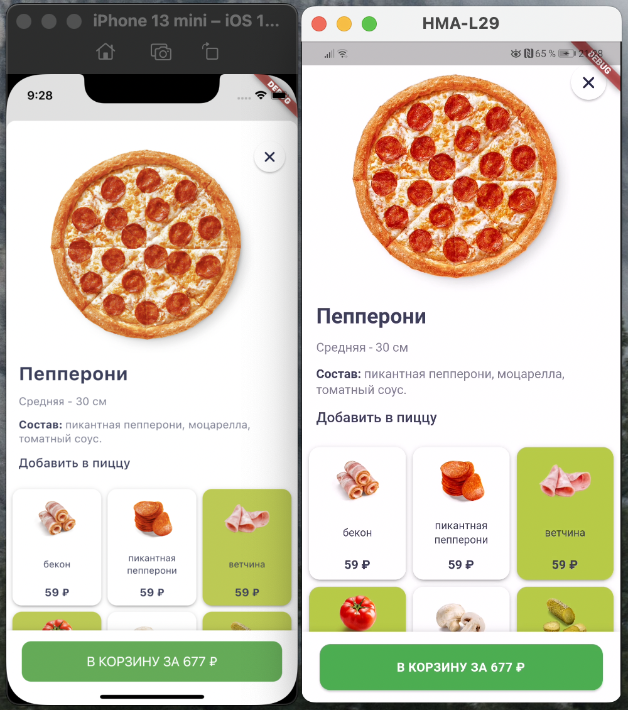
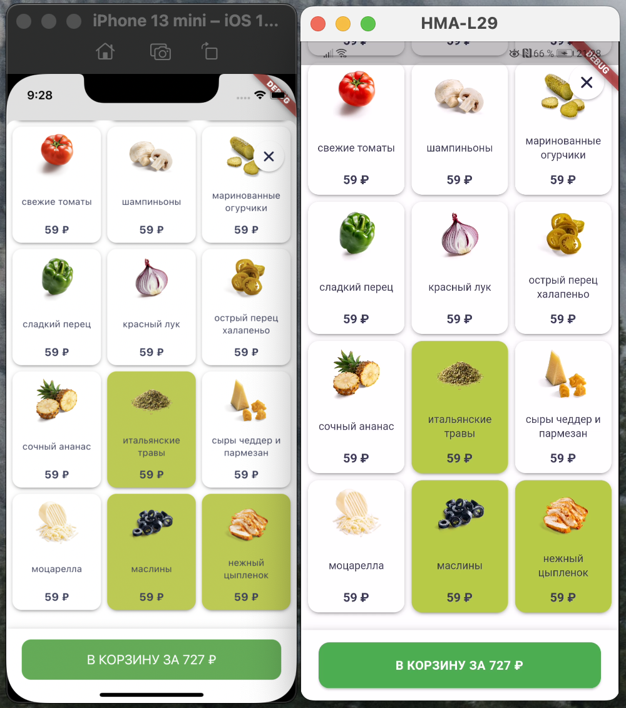
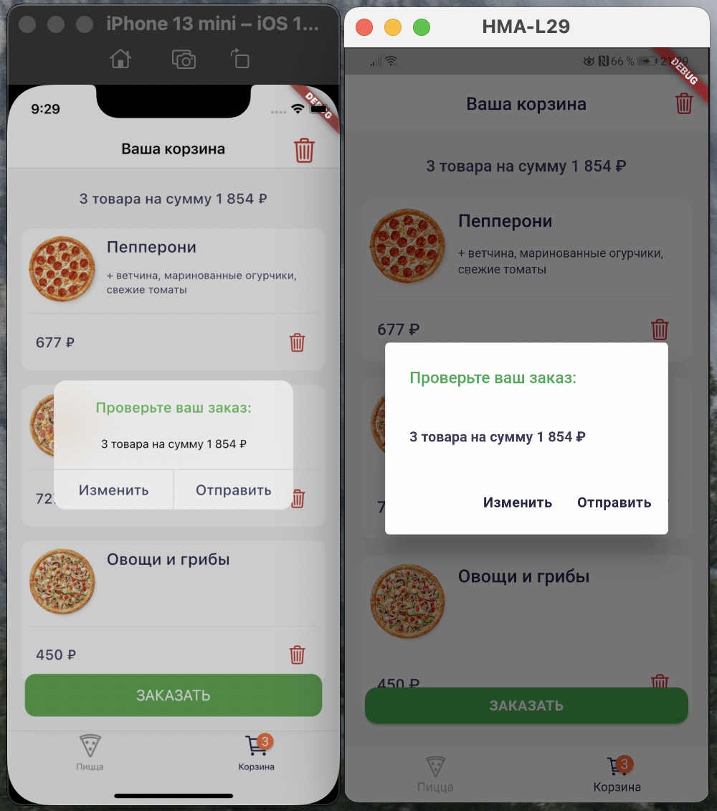

# pizza_elementary

Пример реализации проекта на **elementary** + **mobx** c использованием паттернов проектирования GOF абстрактная фабрика, билдер.

https://pub.dev/packages/elementary

Mobx использовался для реализации корзины заказов.

Паттерн **абстрактная фабрика** использовался для реализации платформенных виджетов:
- Апп бар: CupertinoNavigationBar / AppBar
- Нижняя навигация: CupertinoTabBar / BottomNavigationBar
- Алерт диалоги: CupertinoAlertDialog / AlertDialog
- Кнопка заказа: CupertinoButton / ElevatedButton
- Индикатор загрузки: CupertinoActivityIndicator / CircularProgressIndicator
- PageRoute: CupertinoPageRouter / MaterialPageRouter
- BottomSheet: пакет modal_bottom_sheet

Паттерн **билдер** использовался для создания кастомных экземпляров пиццы

## Demo

 

## Фото

